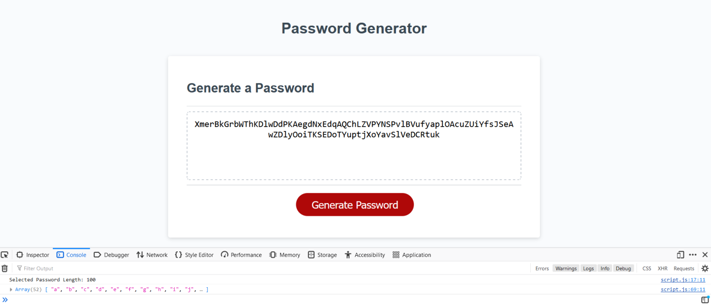

# In this project, I am altering starter code to make a functional password generator.
Link to Page: https://plutocoders.github.io/passwordGen3/

## The repo files are structured in this manner
Develop folder contains files.
- a style.css file, and a script.js file.
- the script.js file contains the project code, and is commented out explaining what i'm trying to do in each section.
- image of page:

## Credits
- I used class resources such as class notes and rewatching zoom sessions to help me complete this project.
- I use w3schools for some questions that I needed answered.
- My brother tried to help me out
- One of my classmates shared valuable insights into how to setup the project
- I used chatgpt for quick answers when I came across issues
- An example of how I used chat gpt: "Can you write out all the letters in the english alphabet, in lower case, with each letter in quotes?" (This helped me make the arrays much faster)
- I also had help during office hours after class from the TA and Professor.
- I had a tutor session with Armando to help me fix up my errors and resubmit the assignment for a better great.
- I am going to youtube stuff to improve this later!